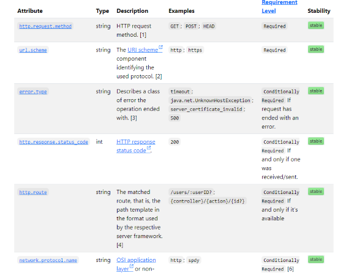

### What is Open Telemetry ?

- Observability toolkit and framework to create and manage telemetry data

#### Overview

- It is vendor and tool agnostic
- Its focus is on generation, collection, management and export - allowing instrumentation irrespective of language, runtime or infrastructure
- It is not a backend like Datadog, Prometheus, Jaeger - no storage, visualisation, querying

- Set of standards and specifications
  - API, wire protocols and semantic standards to allow interoperation
  - Good documentation to explain concepts and details
- Set of implementations - SDKs, Collector

#### Standards & Specifications

- Observability is the ability to understand the internal state of a system, by looking at its output
- What outputs are these? Open Telemetry calls these Signals

- Signals
  - [Metrics](https://opentelemetry.io/docs/concepts/signals/metrics/) - a measurement captured at runtime
  - Traces - allows you to understand the full path of a request through your distributed system
    - Spans - are the individual operations that
  - Logs - timestamped text record, structured or unstructured. May be associated with a span
  - Baggage - context information passed between signals, e.g. between the spans of a trace

#### [Semantic Conventions](https://opentelemetry.io/docs/concepts/semantic-conventions/)

Provide common names for different kinds of operations and data

#### OTLP

Standard to allow 

#### Implementation

Lets look at Language API & SDKs

### Example

