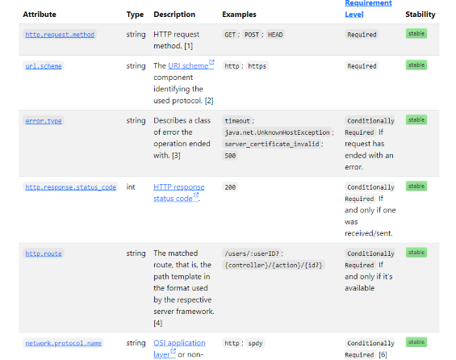
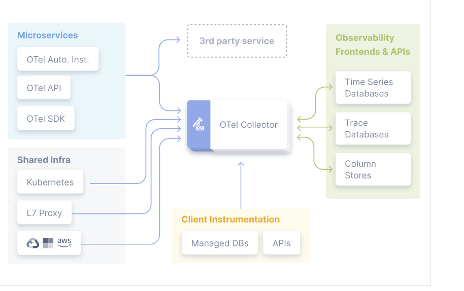
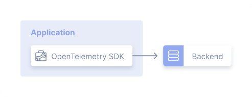
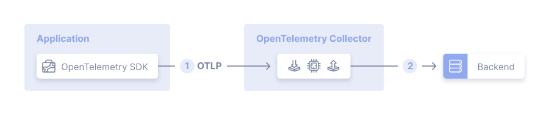
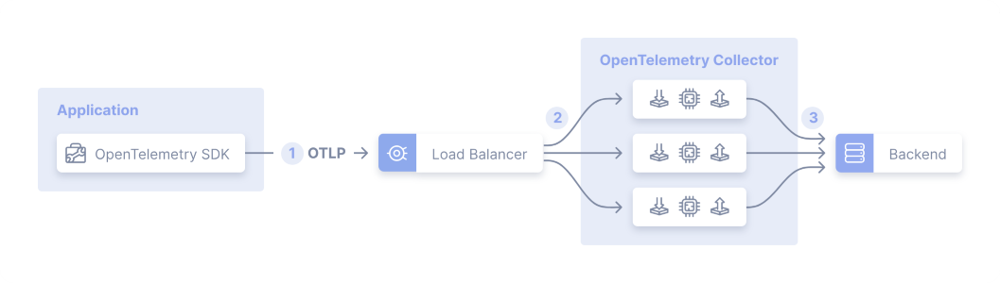
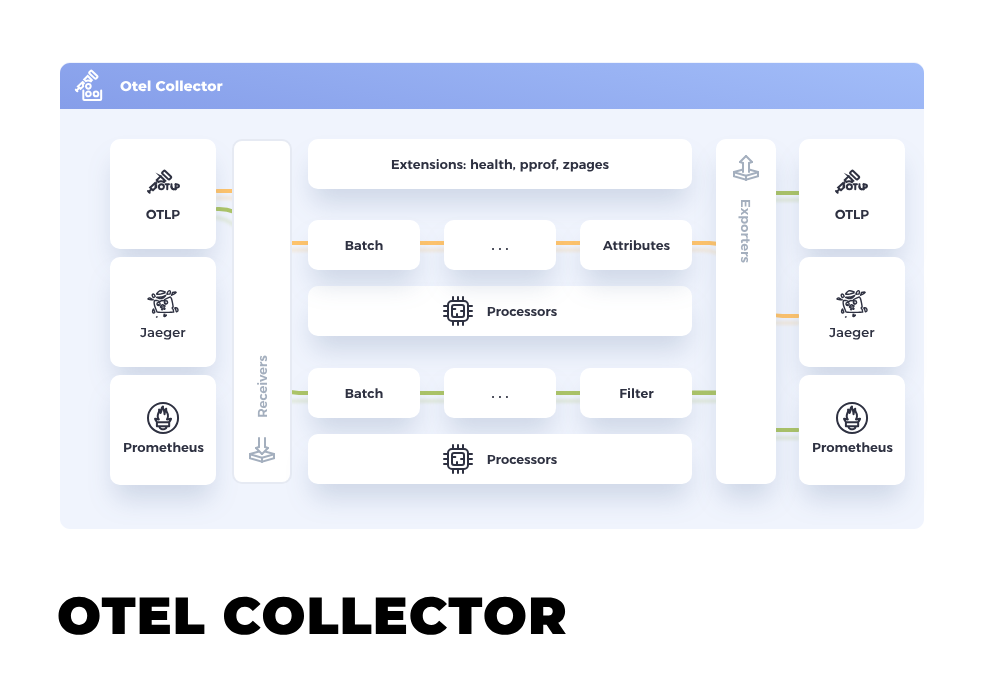
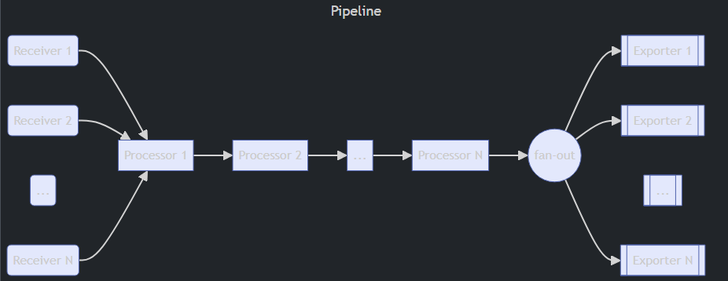
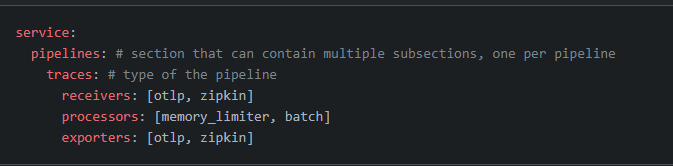
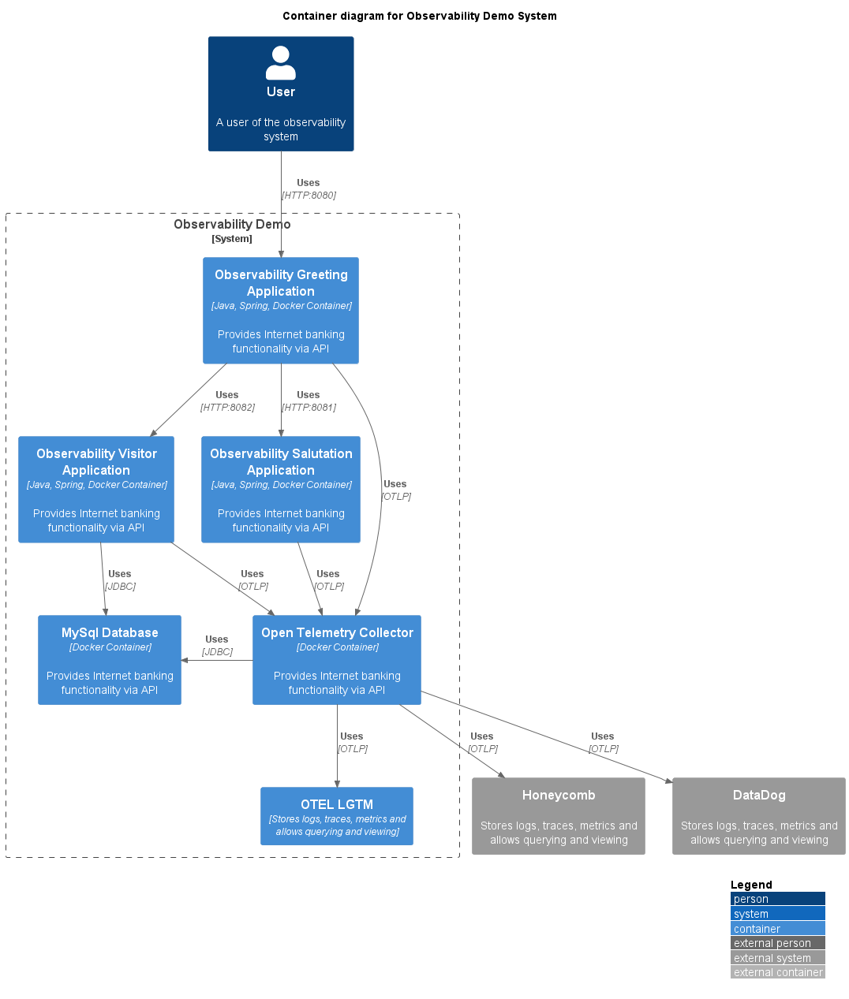

# OpenTelemetry

## Why?

- Looking at observability at work
- Stumbled across announcement of OTEL LGTM
  - Had found other open-source backends a pain
- Decided to look at OpenTelemetry again
- Wanted to put observability in some sort of context
  - A standards-based approach is a good way to understand the concept rather than a specific vendor's view

## Intro

- We'll look at OpenTelemetry concepts
- We'll look at the OpenTelemetry implementation components
- We'll look at a demo
  - Auto Instrumentation

## What is OpenTelemetry?

- Observability toolkit and framework to create and manage telemetry data

## Overview

- It is vendor and tool agnostic
- Its focus is on generation, collection, management and export - allowing instrumentation irrespective of language, runtime or infrastructure
- It is not a backend like Datadog, Prometheus, Jaeger - no storage, visualisation, querying

- Set of standards and specifications
  - API, wire protocols and semantic standards to allow interoperation
  - Good documentation to explain concepts and details
- Set of implementations - SDKs, Collector

## Standards & Specifications

- Observability is the ability to understand the internal state of a system by looking at its output
- What outputs are these? OpenTelemetry calls these Signals

- Signals
  - [Metrics](https://opentelemetry.io/docs/concepts/signals/metrics/) - a measurement captured at runtime
  - Traces - allows you to understand the full path of a request through your distributed system
    - Spans - the individual operations that make up a trace, each with a start time, duration, and attributes
  - Logs - timestamped text record, structured or unstructured; may be associated with a span
  - Baggage - key-value pairs attached to a distributed context and propagated across service boundaries alongside a trace

### [Semantic Conventions](https://opentelemetry.io/docs/concepts/semantic-conventions/)

Provide common names for different kinds of operations and data

### OTLP - OpenTelemetry Protocol

Standard wire protocol for transmitting telemetry data between SDKs, the Collector, and backends. Supports gRPC and HTTP/protobuf transports.

## Implementation

What are the components that the implementation provides

- Language SDKs for Java, .NET, etc.
  - Provides automatic instrumentation (similar to the Datadog Agent) for Spring
  - Instrumentation Libraries
  - Other libraries also support OpenTelemetry, e.g. Micrometer (will see in demo)

- Collector
  - SDKs can talk directly to a backend or via a Collector

  

  - Collector can gather from many sources (OTLP/others) and publish to many backends (OTLP/others)

  
  

- Collector Design

This is how the processing pipeline works in the Collector

See how the pipeline matches the definition in config

## Demo

- Auto Instrumentation - three Spring Boot services instrumented via the Java agent, zero code changes

- Trigger a trace: `curl "http://localhost:8080/greeting?name=World"`
- In Grafana Tempo - a distributed trace spanning all three services
  - HTTP client and server spans created automatically
  - Database span showing the MySQL query from the Visitor service
- In Grafana Loki - logs from all three services, correlated to the same trace ID
- In Grafana/Prometheus - JVM and HTTP metrics exported from all three services

## Summary

- OpenTelemetry provides a vendor-neutral standard for telemetry data
- Auto instrumentation means zero code changes for common frameworks
- The Collector decouples your services from your backend - switch backends without touching your code
- Resources
  - [opentelemetry.io](https://opentelemetry.io)
  - [Java agent](https://opentelemetry.io/docs/zero-code/java/agent/)
  - [Grafana LGTM](https://github.com/grafana/docker-otel-lgtm)
