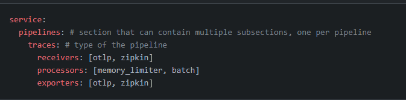

## Why ?

- Looking at observability at work
- Stumbled across announce of OTEL LGTM
  - Had found other OS backends a pain
- Decided to look at OTEL again
- Wanted to put observability in some sort of context
  - Standards based approach are a good way to understand the concept rather than a specific vendor's view

### Intro

- We'll look at Open Telemetry concepts
- We'll look at the Open Telemetry implementation components
- We'll look at a demo
  - Manual Instrumentation 
  - Auto Instrumentation

### What is Open Telemetry ?

- Observability toolkit and framework to create and manage telemetry data

### Overview

- It is vendor and tool agnostic
- Its focus is on generation, collection, management and export - allowing instrumentation irrespective of language, runtime or infrastructure
- It is not a backend like Datadog, Prometheus, Jaeger - no storage, visualisation, querying

- Set of standards and specifications
  - API, wire protocols and semantic standards to allow interoperation
  - Good documentation to explain concepts and details
- Set of implementations - SDKs, Collector

### Standards & Specifications

- Observability is the ability to understand the internal state of a system, by looking at its output
- What outputs are these? Open Telemetry calls these Signals

- Signals
  - [Metrics](https://opentelemetry.io/docs/concepts/signals/metrics/) - a measurement captured at runtime
  - Traces - allows you to understand the full path of a request through your distributed system
    - Spans - are the individual operations that
  - Logs - timestamped text record, structured or unstructured. May be associated with a span
  - Baggage - context information passed between signals, e.g. between the spans of a trace

#### [Semantic Conventions](https://opentelemetry.io/docs/concepts/semantic-conventions/)

Provide common names for different kinds of operations and data

#### OTLP

Standard to allow communication between components

### Implementation

What are the components that the implementation provides

- Language SDKs for Java, .NET, etc
  - Provides Automatic instrumentation (c.f. DataDog Agent) for Spring
  - Instrumentation Libraries
  - Other libraries also support OTEL, e.g. micrometer (will see in demo)

- Collector
  - Libraries can talk direct to backend or via a collector
  
  
  
  - Collector can gather from many sources (OTLP/others) and publish to many backends (OTLP/others)

  
  

- Collector Design  

This is how the processing pipeline works in the collector

See how the pipeline matches the definition in config

#### Demo

- Auto Telemetry

